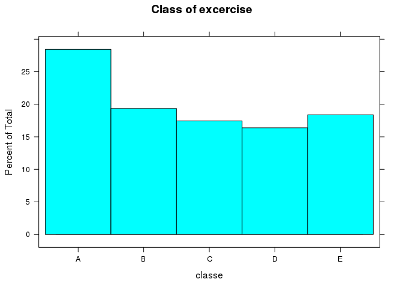
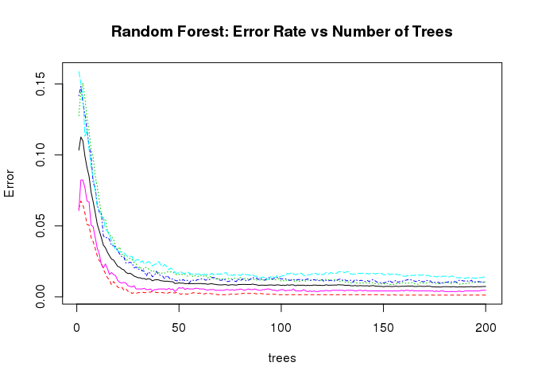

# Machine learning - Course project
Kuzovikhin Anton  
25 March 2016  

## 1. Executive Summary

This project uses a random forest model to predict classification of how well subjects performed a exercise. It describes the step by step process to create the model and predict 20 different test cases. 

## 2. Data Processing

The first step is to load the data set and the packages required for the analysis.

```r
library(caret)
```

```
## Loading required package: lattice
```

```
## Loading required package: ggplot2
```

```r
library(lattice)
library(randomForest)
```

```
## randomForest 4.6-12
```

```
## Type rfNews() to see new features/changes/bug fixes.
```

```r
setwd("/home/anton/Practical-Machine-Learning-Course-Project")
train <- read.csv("pml-training.csv", na.strings="NA")
submittest<-read.csv("pml-testing.csv", na.strings="NA")
```
This analysis allows us to note two main points : 1 - some numeric data have been imported as factor because of the presence of some characters (c("#DIV/0!","NA","")), 2 - some columns have a really low completion rate (a lot of missing data). So that we need redo reading data with new conditions.

```r
train <- read.csv("pml-training.csv", na.strings=c("NA","#DIV/0!",""))
submittest <- read.csv("pml-testing.csv", na.strings=c("NA","#DIV/0!",""))
```
As we could see, the first seven columns may be removed

```r
train<-train[,-c(1:7)]
submittest<-submittest[,-c(1:7)]
```
Then we need to remove columns with large number of NA's

```r
varNA<-sapply(train, function(x) mean(is.na(x))) > 0.95
train<-train[,varNA==FALSE]
varNA<-sapply(submittest, function(x) mean(is.na(x))) > 0.95
submittest<-submittest[,varNA==FALSE]
```

## 3. Exploratory analysis

Then we need to plot 'classe' variable. 

```r
histogram(~classe,  data = train,main = "Class of excercise")
```



Its distribution suggests that a standardization should not be necessary.

## 4. Data modeling

We need to divide training set into two sets: the first is for training, the second is for cross-validation.

```r
set.seed(10000)
inTrain <- createDataPartition(y=train$classe, p=0.6, list=F)
trainfortraining <- train[inTrain, ]
trainforcrossvalidation <- train[-inTrain, ]
```
Then we use Random Forest, because it has the most powerful prediction algorhytm (as it is said in lectures)

```r
set.seed(1234)
modelrf<-randomForest(classe~., data = trainfortraining,ntree=200)
print(modelrf)
prediction_1 <- predict(modelrf, trainforcrossvalidation, type = "class")
confusionMatrix(trainforcrossvalidation$classe, prediction_1)
plot(modelrf,main="Random Forest: Error Rate vs Number of Trees")
```



As seen by the result of the confusionmatrix, the model is good and efficient because it has an accuracy of 0.992 and very good sensitivity & specificity values on the testing dataset

```r
prediction_submit <- predict(modelrf, submittest, type = "class")
print(prediction_submit)
```

## 5. Conclusion

It seems RF is very good because it scores 100% (20/20) on the Course Project Submission (the 20 values to predict). I did not try to play with preprocessing generating PCA or scale & center the features because of enough result of Random Forest without any additional steps.


